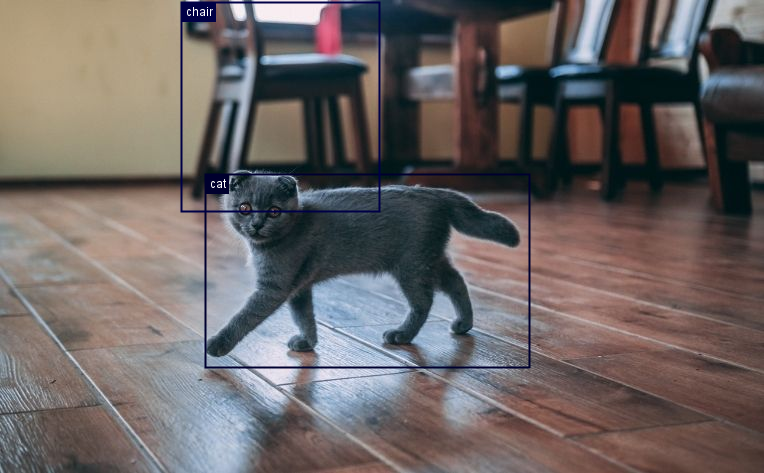

# Object Detection with DJL

This project demonstrates how to perform object detection using the Deep Java Library (DJL).

The Deep Java Library (DJL) provides an open-source, high-level, engine-agnostic Java framework for deep learning. It’s designed to be easy to get started with and simple to use for Java developers. DJL offers a native Java development experience and functions like any other regular Java library1. Specifically for PyTorch integration, DJL includes the PyTorch Engine, which allows you to work with PyTorch models in Java

## Usage

1. Ensure you have Java and Kotlin installed on your system.
2. Clone this repository to your local machine.
3. Navigate to the project directory.
4. Run the main Kotlin file

## Sample Image

The object detection is performed on the following image:

## Results

The annotated image with bounding boxes drawn around detected objects will be saved to `results/result.png`.

###

Referance 

https://docs.djl.ai/engines/pytorch/index.html
